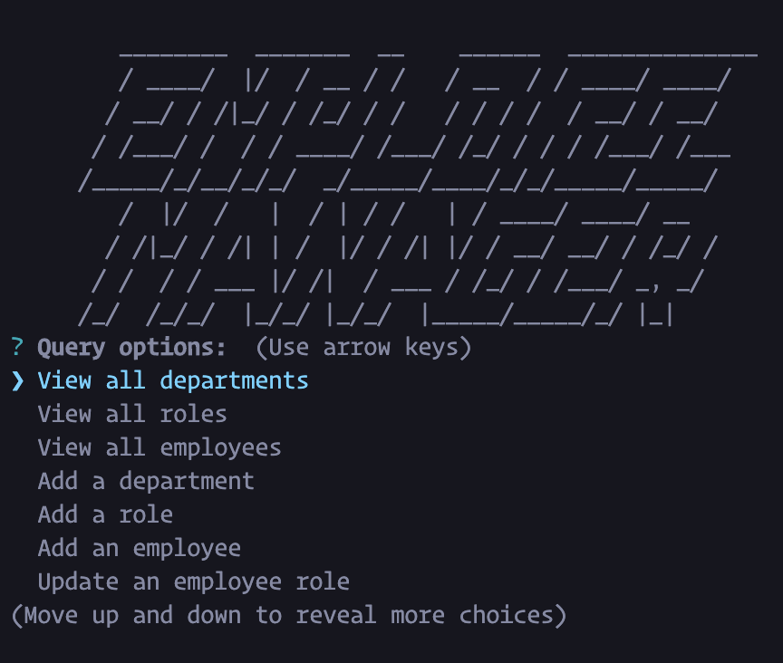
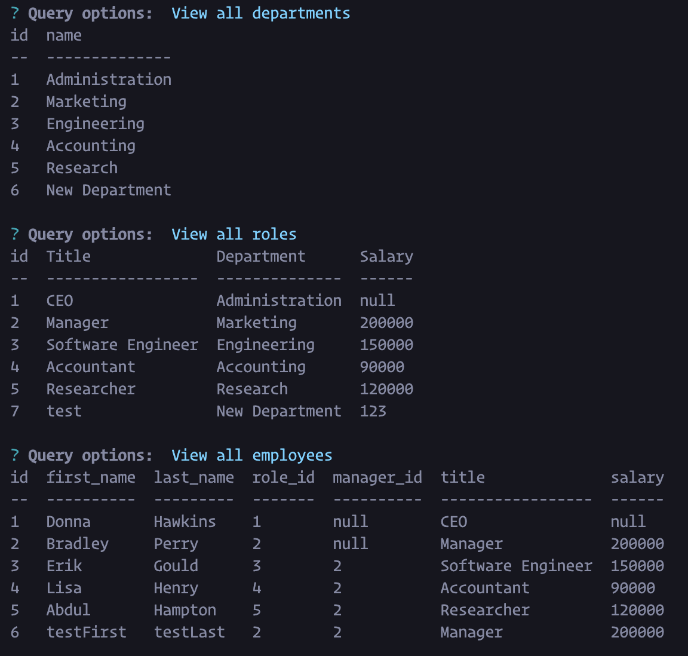

# SQL Employee Tracker
## Table of Contents
1. [Description](#description)
2. [Installation](#installation)
3. [Usage](#usage)
4. [Example Images](#example-images)
## Description
This is an application for companies to create and update employees, departments and roles. This is done through the command line using mysql and inquirer. 

## Installation
First, to use this app you must have mysql downloaded onto your machine. If you don't already have it installed, you can follow these instructions on the offical mysql website: [mysql website](https://dev.mysql.com/doc/mysql-installation-excerpt/5.7/en/)

After you have installed mysql, to install this employee tracker app, clone this repo to your local machine. Once cloned, navigate to the applications's root directory within your terminal and run:
```
npm install
``` 
to install the necessary dependencies. 

## Usage
To use this app, after you have installed the necessary dependencies, you will need to set up the mysql database. While in the application's root directory run the following command:
```
mysql -u root -p < db/schema.sql
```
If you'd like to seed the database with example values, run the following:
```
mysql -u root -p < db/seeds.sql
```

Once complete run the following to start the application:
```
node server.js
```
The app should have began, now choose an option and begin!

## Example Images



### Checkout more of my projects [here](https://github.com/taicedtea)!